# A biblioteca matplotlib

O Matplotlib é provavelmente a biblioteca Python mais usada para criar gráficos. Ele fornece uma maneira rápida de gráficos de dados em vários formatos de alta qualidade que podem ser compartilhados e/ou publicados. Nesta seção, veremos os usos mais comuns do [matplotlib](https://matplotlib.org/).

## pyplot

*pyplot* fornece uma interface para a biblioteca matplotlib. O Pyplot é projetado no estilo do Matlab e a maioria dos comandos de plotagem do pyplot tem análogos do Matlab com argumentos semelhantes.

``` python
from matplotlib import pyplot as plt
```

## Plots simples

Para começar, vamos plotar as funções *seno* e *cosseno* no mesmo gráfico. A partir da configuração básica, vamos alterar o gráfico passo a passo para que fique como queremos.\
Por exemplo, se quisermos fazer o plot de um circulo.

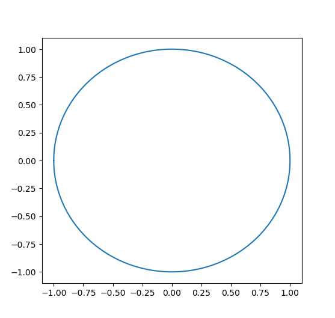

Primeiro você tem que obter os dados para o gráfico:

``` python
import numpy as np

X = np.linspace(-np.pi, np.pi, 256)
C, S = np.cos(X), np.sin(X)
```

Agora temos uma matriz de numpy com 256 valores que variam de -π a +π (inclusive). C tem os valores de cosseno (256 valores) e S tem os valores de seno (256 valores).

### O gráfico padrão

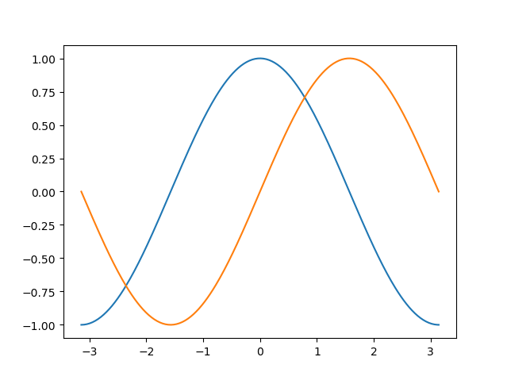

No Matplotlib, os gráficos têm configurações padrão. Porém, você pode configurar muitas delas. Pode alterar o tamanho da figura, o DPI (determina a resolução da figura), o tamanho, cor e estilo do traço, as propriedades dos eixos e da grade, os textos e suas propriedades, etc.

``` python
import numpy as np
import matplotlib.pyplot as plt

X = np.linspace(-np.pi, np.pi, 256)
C, S = np.cos(X), np.sin(X)

plt.plot(X, C)
plt.plot(X, S)

plt.show()
```

### Um gráfico básico

No script a seguir, explicamos e comentamos todas as propriedades de uma figura que influenciam a aparência de um gráfico.

Cada propriedade foi definida com um valor típico e próximo ao valor padrão. Você pode modificar e brincar com eles para ver seus efeitos no gráfico. Sobre propriedades e estilos das linhas falaremos mais adiante.

``` python
import numpy as np
import matplotlib.pyplot as plt

plt.style.use('_mpl-gallery')

# Crie uma nova forma, 8x6 polegadas, com 80 pontos por polegada
plt.figure(figsize=(8, 6), dpi=80)

# Cria um novo subplot, em uma grade 1x1
plt.subplot(1, 1, 1)

X = np.linspace(-np.pi, np.pi, 256)
C, S = np.cos(X), np.sin(X)

# Plote o cosseno com uma linha azul sólida de largura 1 (em pixels)
plt.plot(X, C, color="blue", linewidth=1.0, linestyle="-")

# Plote o seno com uma linha verde sólida de largura 1 (em pixels)
plt.plot(X, S, color="green", linewidth=1.0, linestyle="-")

# intervalo do eixo x
plt.xlim(-4,0, 4,0)

# Colocamos marcas (tiques) no eixo x
plt.xticks(np.linspace(-4, 4, 9))

# intervalo do eixo y
plt.ylim(-1.1,1.1)

# Colocamos marcas (tiques) no eixo y
plt.yticks(np.linspace(-1, 1, 5))

# Podemos gravar o gráfico (com 72 dpi)
# plt.savefig("exercise_2.png)", dpi=72)

# mostra o resultado na tela
plt.show()
```

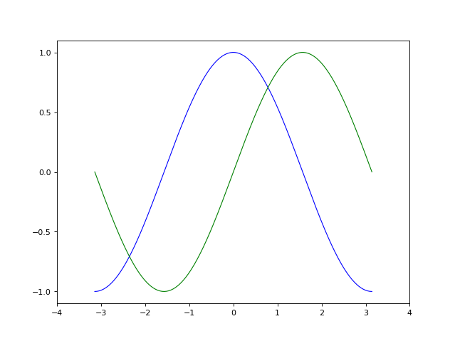

Os gráficos gerados pelo matplotlib são muito flexíveis, deixamos para você [um link](https://github.com/matplotlib/cheatsheets) resumindo as variações mais comuns.

Abaixo estão os detalhes técnicos desta biblioteca muito útil. Você não precisa aprendê-los (você provavelmente os esquecerá de qualquer maneira).

## Detalhes de um enredo simples

### Como alterar as cores e a largura dos traços

 Agora vamos modificar o gráfico para torná-lo um pouco melhor. Primeiro, queremos traçar o cosseno em azul e o seno em vermelho, e ambos com uma linha um pouco mais grossa. Além disso, vamos alterar um pouco o tamanho da figura para torná-la paisagem. Executei o código a seguir e comparei o resultado com a figura anterior.

``` python
...
plt.figure(figsize=(10, 6), dpi=80)
plt.plot(X, C, color="red", linewidth=2.5, linestyle="-")
plt.plot(X, S, color="blue", linewidth=2.5, linestyle="-")
...
```

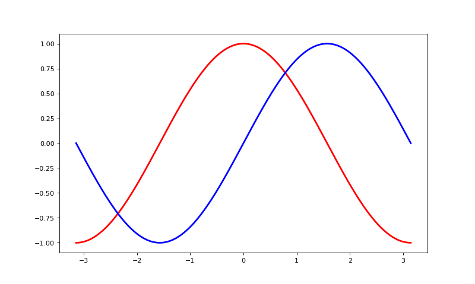

### Limites do eixo

 A faixa de valores para os eixos é um pouco estreita e precisamos de mais espaço ao redor para ver todos os pontos com clareza.

``` python
...
plt.xlim(X.min() * 1.1, X.max() * 1.1)
plt.ylim(C.min() * 1.1, C.max() * 1.1)
...
```


### Marcas nos eixos

Como está, as marcas nos eixos não são as mais úteis. Seria bom destacar os valores interessantes para seno e cosseno (+/-π,+/-π/2). Vamos alterá-los para exibir apenas esses valores.

``` python
...
plt.xticks([-np.pi, -np.pi/2, 0,np.pi/2, np.pi])
plt.yticks([-1, 0, +1])
...
```

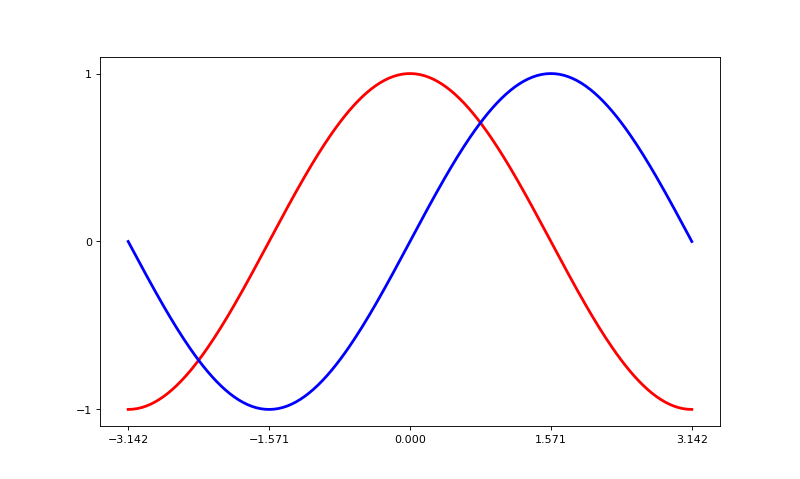

### Texto das marcas nos eixos

As marcas nos eixos estão agora onde queremos, mas o texto não é muito explícito. Embora possamos perceber que 3,142 é π, seria melhor deixá-lo explícito.

Note que vamos usar [*LaTeX*](https://es.wikipedia.org/wiki/LaTeX) para melhorar a aparência dos símbolos.

``` python
...
plt.xticks([-np.pi, -np.pi/2, 0, np.pi/2, np.pi],
          [r'$-\pi$', r'$-\pi/2$', r'$0$', r'$+\pi/2$', r'$+\pi$'])

plt.yticks([-1, 0, +1],
          [r'$-1$', r'$0$', r'$+1$'])
...
```

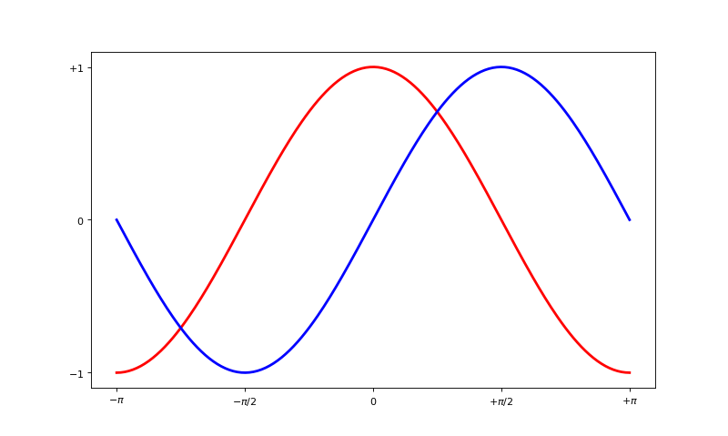

### Vamos mover o contorno

O contorno é o conjunto de linhas que delimitam a área gráfica e que unem todas as marcas nos eixos. Podemos colocá-los em qualquer posição e, até agora, eles estavam no final de cada eixo. Vamos mudar isso, então vamos colocá-los no centro. Como são quatro (superior, inferior, esquerda e direita), vamos ocultar dois deles dando-lhes a cor `none` e vamos mover o inferior e o esquerdo para a posição 0 do espaço de coordenadas.

``` python
...
ax = plt.gca() # gca é 'obter o eixo atual'
ax.spines['right'].set_color('none')
ax.spines['top'].set_color('none')
ax.xaxis.set_ticks_position('bottom')
ax.spines['bottom'].set_position(('data',0))
ax.yaxis.set_ticks_position('left')
ax.spines['left'].set_position(('data',0))
...
```

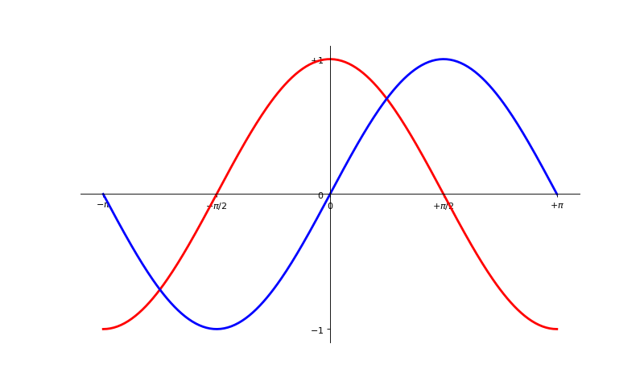

### Vamos colocar uma legenda

 Vamos nomear os gráficos no gráfico no canto superior esquerdo. Para fazer isso, basta adicionar a palavra-chave `label` à instrução `plot` e esse texto será usado para a caixa de nome.

``` python
...
plt.plot(X, C, color="blue", linewidth=2.5, linestyle='-', label="Cosseno")
plt.plot(X, S, color="red", linewidth=2.5, linestyle="-", label="Seno")

plt.legend(loc='upper left')
...
```

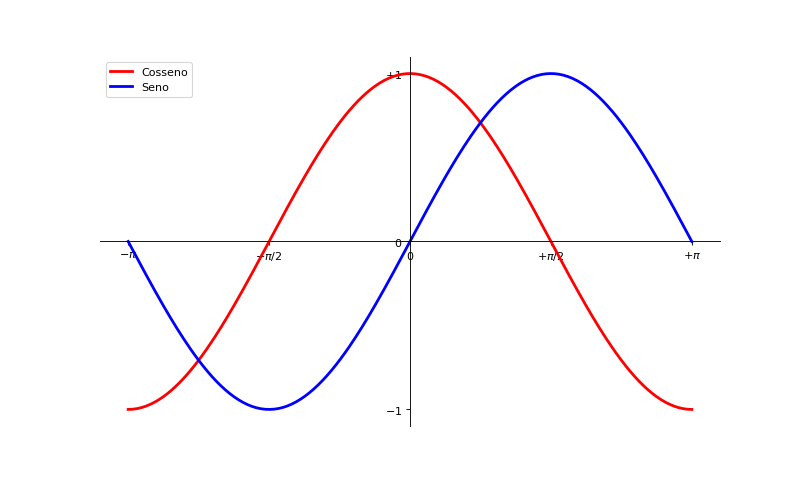

### Alguns pontos interessantes

 Vamos marcar alguns pontos interessantes usando o comando `annotate`. Escolhemos o valor 2π/3 e queremos traçar o seno e o cosseno. Vamos desenhar uma marca na curva e uma linha reta pontilhada. Além disso, vamos usar `annotate` para exibir texto e uma seta para destacar o valor das funções.

``` python
...

t = 2 * np.pi / 3
plt.plot([t, t], [0, np.cos(t)], color='blue', linewidth=2.5, linestyle="--")
plt.scatter([t, ], [np.cos(t), ], 50, color='blue')

plt.annotate(r'$cos(\frac{2\pi}{3})=-\frac{1}{2}$',
             xy=(t, np.cos(t)), xycoords='data',
             xytext=(-90, -50), textcoords='offset points', fontsize=16,
             arrowprops=dict(arrowstyle="->", connectionstyle="arc3,rad=.2"))

plt.plot([t, t],[0, np.sin(t)], color='red', linewidth=2.5, linestyle="--")
plt.scatter([t, ],[np.sin(t), ], 50, color='red')

plt.annotate(r'$sin(\frac{2\pi}{3})=\frac{\sqrt{3}}{2}$',
             xy=(t, np.sin(t)), xycoords='data',
             xytext=(+10, +30), textcoords='offset points', fontsize=16,
             arrowprops=dict(arrowstyle="->", connectionstyle="arc3,rad=.2"))
...
```

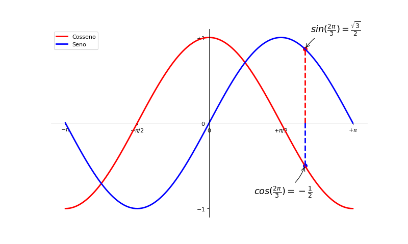

### Mais detalhes

Observe que os eixos obscurecem os traços das funções seno e cosseno, e as funções cosseno obscurecem os valores escritos nos eixos. Se isso fosse um post ficaria feio.

Podemos aumentar as marcas e os textos e ajustar suas propriedades para que fiquem semitransparentes. Isso nos permitirá ver os dados e os textos um pouco melhor.

``` python
...
for label in ax.get_xticklabels() + ax.get_yticklabels():
    label.set_fontsize(16)
    label.set_bbox(dict(facecolor='white', edgecolor='None', alpha=0.50))
...
```

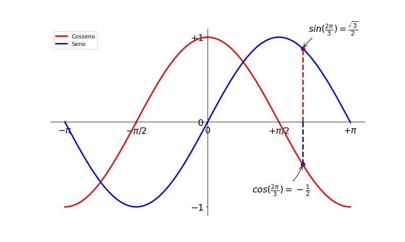

## Figuras, subplots, eixos e marcas (ticks)

No matplotlib, o termo "figura" refere-se a toda a janela que compõe a interface do usuário.

Enquanto o *subplot* coloca seus gráficos em posições espaçadas regularmente (uma grade), dependendo do que você está procurando.

### Figuras

Uma "figura" é a janela na interface do usuário que tem o título "Figura #" numeradas a partir de 1. Vários parâmetros determinam a aparência de uma forma:

Argumento | Padrão | Descrição
--- | --- | ---
num | 1 | número da figura
figsize | figure.figsize | tamanho da figura em polegadas (largura, altura)
dpi | figura.dpi | resolução em pontos por polegada
facecolor | figura.facecolor | cor de fundo
edgecolor | figure.edgecolor | cor da borda ao redor do fundo
frameon | True | desenhar uma caixa para a figura?

``` python
plt.close(1) # Fechar figura 1
```

Infelizmente o sistema ingles é o padrão no matplotlib.

Podemos usar uma função auxiliar como esta para converter uma distância de *cm* para *polegadas*:

``` python
def cm2inch(valor):
    return valor/2,54

fig = plt.figure(figsize=(cm2inch(12,8), cm2inch(9,6)))
```

### Subplots

Você pode organizar seus gráficos em uma grade em intervalos regulares se usar `subplots`.

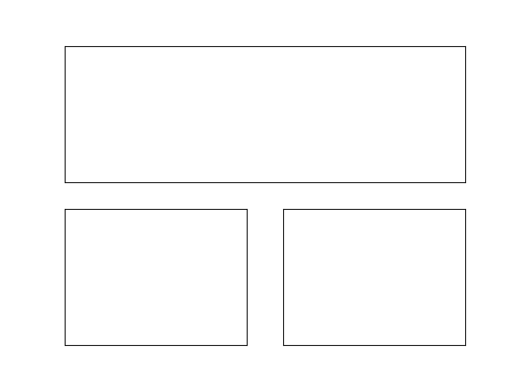

Você só precisa especificar o número de linhas, o número de colunas e, finalmente, o número do subplot para ativar a subplot correspondente.

Exemplo:


Exemplo:


Exemplo:

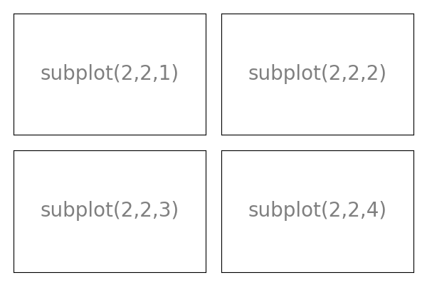

### Eixos

Você pode usar os eixos para colocar os gráficos em qualquer lugar da figura. Se quisermos inserir um gráfico pequeno em um maior, podemos fazê-lo movendo seus eixos.

Exemplo:

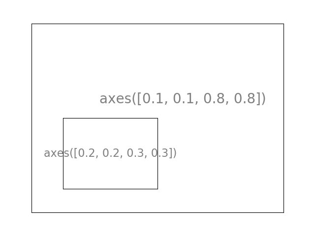

Exemplo:

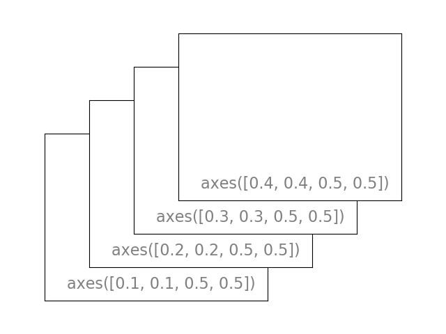

## Retono ao [sumario](./00_Resumo.md)