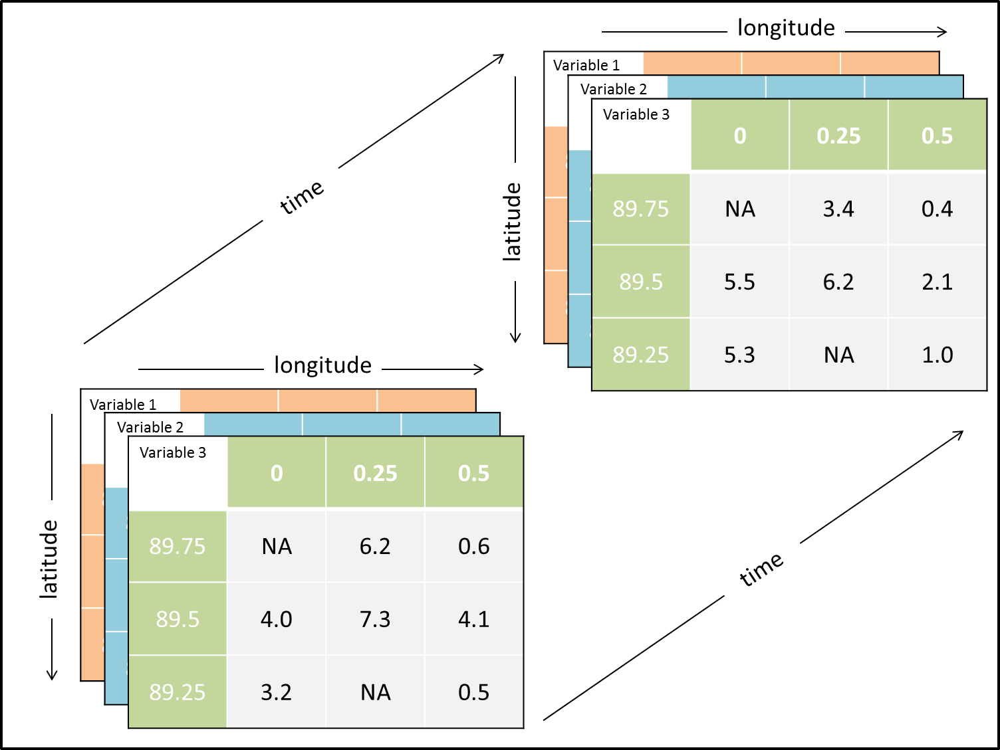

# netCDF4

É implementada sobre a biblioteca HDF5, este módulo pode ler e gravar arquivos no novo formato netCDF-4 e no antigo formato netCDF-3 e criar arquivos que podem ser lidos por clientes HDF5.

> Afinal, o que é HDF5? Resumidamente, HDF5 é um modelo de dados que permite que seu conteúdo possa ser facilmente manipulado – mesmo quando o tamanho do dataset ultrapassa os gigabytes. Baseado em estruturação hierárquica de dados, é um formato muito usado em machine learning e na comunidade acadêmica. Para maior informação acesse o [link](https://sigmoidal.ai/hdf5-armazenamento-para-deep-learning/#:~:text=Afinal%2C%20o%20que%20%C3%A9%20HDF5,learning%20e%20na%20comunidade%20acad%C3%AAmica.).



## Manipulando um arquivo netCDF

Para criar arquivos netCDF utilizando o Python simplesmente devemos usar o construtor `Dataset`, o mesmo pode ser utilizado para abrir arquivos.

Para chamar a biblioteca podemos utilizar a seguinte forma:

```python
from netCDF4 import Dataset

ncfile = Dataset('data.nc', mode='r')
```

Modos de abrir o arquivo netCDF:

- `mode = 'r'` é o modo padrão
- `mode = 'a'` abre no modo de anexar (vários arquivos)
- `mode = 'w'` modo de escrita

### Acesso à metadata

Para este exemplo utilizaremos um arquivo de saída do modelo WRF.

```python
>>> file='/home/ragy/Documents/wrfout/wrf_vix-2017/wrfout_d01_2017-12-05_00:00:00'

>>> from netCDF4 import Dataset
>>> ncfile = Dataset(file, 'r')
>>> print(ncfile) # resultado deste comando
<class 'netCDF4._netCDF4.Dataset'>
root group (NETCDF3_64BIT_OFFSET data model, file format NETCDF3):
    TITLE:  OUTPUT FROM WRF V4.2.1 MODEL
    START_DATE: 2017-12-05_00:00:00
    SIMULATION_START_DATE: 2017-12-05_00:00:00
    WEST-EAST_GRID_DIMENSION: 73
    SOUTH-NORTH_GRID_DIMENSION: 73
    BOTTOM-TOP_GRID_DIMENSION: 44
    ...
```

Outra maneira de conferir a metadata é verificar no modo dicionário.

```python
>>> print(ncfile.__dict__)
{'TITLE': ' OUTPUT FROM WRF V4.2.1 MODEL', 'START_DATE': '2017-12-05_00:00:00', 'SIMULATION_START_DATE': '2017-12-05_00:00:00', 'WEST-EAST_GRID_DIMENSION': 73, 'SOUTH-NORTH_GRID_DIMENSION': 73, 'BOTTOM-TOP_GRID_DIMENSION': 44, 'DX': 9000.0, 'DY': 9000.0, 'AERCU_OPT': 0, 'AERCU_FCT': 1.0, 'IDEAL_CASE': 0, 'DIFF_6TH_SLOPEOPT': 0, 'AUTO_LEVELS_OPT': 2, 'DIFF_6TH_THRESH': 0.1, 'DZBOT': 4.0, 'DZSTRETCH_S': 1.3, 'DZSTRETCH_U': 1.1, 'SKEBS_ON': 0, 'SPEC_BDY_FINAL_MU': 1, 'USE_Q_DIABATIC': 0, 'GRIDTYPE': 'C', 
...
```

Verificar o início do período:

```python
>>> ncfile.__dict__['START_DATE']
'2017-12-05_00:00:00'
```

### Dimensões

O acesso às dimensões é semelhante aos metadados do arquivo. Cada dimensão é armazenada como uma classe de dimensão que contém informações relevantes. Metadados para todas as dimensões podem ser acessados ​​fazendo um loop por todas as dimensões disponíveis.

```python
>>> ncfile.dimensions
{'Time': <class 'netCDF4._netCDF4.Dimension'> (unlimited): name = 'Time', size = 11,
 'DateStrLen': <class 'netCDF4._netCDF4.Dimension'>: name = 'DateStrLen', size = 19,
 'west_east': <class 'netCDF4._netCDF4.Dimension'>: name = 'west_east', size = 72,
 'south_north': <class 'netCDF4._netCDF4.Dimension'>: name = 'south_north', size = 72,
...
```

### Variáveis

Acesse metadados de variáveis ​​da mesma maneira que dimensões. O código abaixo mostra como isso é feito.

```python
>>> ncfile.variables
{'Times': <class 'netCDF4._netCDF4.Variable'>
|S1 Times(Time, DateStrLen)
unlimited dimensions: Time
current shape = (11, 19)
filling on, default _FillValue of  used, 'XLAT': <class 'netCDF4._netCDF4.Variable'>
float32 XLAT(Time, south_north, west_east)
    FieldType: 104
    MemoryOrder: XY 
    description: LATITUDE, SOUTH IS NEGATIVE
    units: degree_north
    stagger: 
    coordinates: XLONG XLAT
unlimited dimensions: Time
current shape = (11, 72, 72)
filling on, default _FillValue of 9.969209968386869e+36 used, 'XLONG': <class 'netCDF4._netCDF4.Variable'>
float32 XLONG(Time, south_north, west_east)
    FieldType: 104
    MemoryOrder: XY 
...
```

O trecho mostrado acima retorna a descrição completa das variáveis, porém, se precisarmos de saber os nomes de todas as variáveis podemos utilizar `ncfile.variables.keys()`.

```python
>>> ncfile.variables.keys()
dict_keys(['Times', 'XLAT', 'XLONG', 'LU_INDEX', 'ZNU', 'ZNW', 'ZS', 'DZS', 'VAR_SSO', 'U', 'V', 'W', 'PH', 'PHB', 'T', 'THM', 'HFX_FORCE', 'LH_FORCE', 'TSK_FORCE', 'HFX_FORCE_TEND', 'LH_FORCE_TEND', 'TSK_FORCE_TEND', 'MU', 'MUB', 'NEST_POS', 'P', 'PB', 'FNM', 'FNP', 'RDNW', 'RDN', 'DNW', 'DN', 'CFN', 'CFN1', 'THIS_IS_AN_IDEAL_RUN', 'P_HYD', 'Q2', 'T2', 'TH2', 'PSFC', 'U10', 'V10', 'RDX', 'RDY', 'AREA2D', 'DX2D', 'RESM', 'ZETATOP', 'CF1', 'CF2', 'CF3', 'ITIMESTEP', 'XTIME', 'QVAPOR', 'QCLOUD', 'QRAIN', 'QICE', 'QSNOW', 'QGRAUP', 'SHDMAX', 'SHDMIN', 'SNOALB', 'TSLB', 'SMOIS', 'SH2O', 'SMCREL', 'SEAICE', 'XICEM', 'SFROFF', 'UDROFF', 'IVGTYP', 'ISLTYP', 'VEGFRA', 'GRDFLX', 'ACGRDFLX', 'ACSNOM', 'SNOW', 'SNOWH', 'CANWAT', 'SSTSK', 'COSZEN', 'LAI', 'VAR', 'MAPFAC_M', 'MAPFAC_U', 'MAPFAC_V', 'MAPFAC_MX', 'MAPFAC_MY', 'MAPFAC_UX', 'MAPFAC_UY', 'MAPFAC_VX', 'MF_VX_INV', 'MAPFAC_VY', 'F', 'E', 'SINALPHA', 'COSALPHA', 'HGT', 'TSK', 'P_TOP', 'T00', 'P00', 'TLP', 'TISO', 'TLP_STRAT', 'P_STRAT', 'MAX_MSTFX', 'MAX_MSTFY', 'RAINC', 'RAINSH', 'RAINNC', 'SNOWNC', 'GRAUPELNC', 'HAILNC', 'CLDFRA', 'SWDOWN', 'GLW', 'SWNORM', 'ACSWUPT', 'ACSWUPTC', 'ACSWDNT', 'ACSWDNTC', 'ACSWUPB', 'ACSWUPBC', 'ACSWDNB', 'ACSWDNBC', 'ACLWUPT', 'ACLWUPTC', 'ACLWDNT', 'ACLWDNTC', 'ACLWUPB', 'ACLWUPBC', 'ACLWDNB', 'ACLWDNBC', 'SWUPT', 'SWUPTC', 'SWDNT', 'SWDNTC', 'SWUPB', 'SWUPBC', 'SWDNB', 'SWDNBC', 'LWUPT', 'LWUPTC', 'LWDNT', 'LWDNTC', 'LWUPB', 'LWUPBC', 'LWDNB', 'LWDNBC', 'OLR', 'XLAT_U', 'XLONG_U', 'XLAT_V', 'XLONG_V', 'ALBEDO', 'CLAT', 'ALBBCK', 'EMISS', 'NOAHRES', 'TMN', 'XLAND', 'UST', 'PBLH', 'HFX', 'QFX', 'LH', 'ACHFX', 'ACLHF', 'SNOWC', 'SR', 'SAVE_TOPO_FROM_REAL', 'HFX_FDDA', 'ISEEDARR_SPPT', 'ISEEDARR_SKEBS', 'ISEEDARR_RAND_PERTURB', 'ISEEDARRAY_SPP_CONV', 'ISEEDARRAY_SPP_PBL', 'ISEEDARRAY_SPP_LSM', 'C1H', 'C2H', 'C1F', 'C2F', 'C3H', 'C4H', 'C3F', 'C4F', 'PCB', 'PC', 'LANDMASK', 'LAKEMASK', 'SST', 'SST_INPUT'])
```

E finalmente, podemos explorar cada variável separadamente.

```python
>>> ncfile.variables['U']
<class 'netCDF4._netCDF4.Variable'>
float32 U(Time, bottom_top, south_north, west_east_stag)
    FieldType: 104
    MemoryOrder: XYZ
    description: x-wind component
    units: m s-1
    stagger: X
    coordinates: XLONG_U XLAT_U XTIME
unlimited dimensions: Time
current shape = (11, 43, 72, 73)
filling on, default _FillValue of 9.969209968386869e+36 used
```

> Os usuários do WRF podem utilizar a biblioteca [wrf-python](https://wrf-python.readthedocs.io/en/latest/index.html).

## Retorno ao [sumário](./00_Resumo.md)